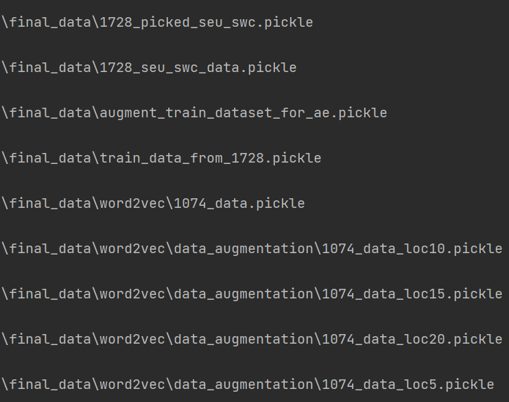

###
The 139.155.28.154 server failed temporarily, we are reparing now, please wait for a while.
###

### Notes:

#### Contents in this repository : 

1. in 'src' folder :

   auto_encoder.py: to train autoencoder model

   classifier.py: to train HAN model

   dataset_gen.py: to transform swc files to sequences

   model_utils.py: deep learning models are defined here

   parallel_persistence_homology.py: to evaluate persistent homology based framework [Li Y, D Wang, Ascoli G A, et al. Metrics for comparing neuronal tree shapes based on persistent homology[J]. Plos One, 2016, 12(8): e0182184] on our dataset.

   robust_test.py: to test the robustness of HAN model.

2.  in 'jupyter' folder: to generate figures in our paper.

3.  in 'raw_dataset' folder: SWC files used in this study.

4.  in 'result' folder: training results of the three models.

#### Large file

Due to the github policy, large file exceeding 100M can not be submmit. So we provide there files in our local server, please go to http://139.155.28.154:8500/, download files you may need, and place them in proper directories.

See figure below:

